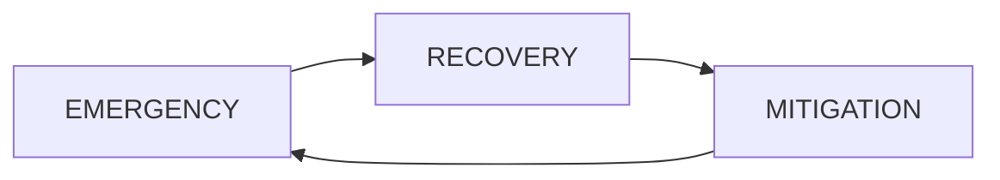

# SPFP : lecture 14/12/2021

The flood risk management continuous cycle :

- MITIGATION (*atténuation*) = return to the before flood state and review the lesson learned 

Their is an importance of psychology or sociology to let people know "everybody is not always safe"

**FEMA Goals** : (the USA agency )

+ reduction of economic losses and safety 
+ preserve the natural environnment 

Create building code to try to respect this goals. Kinda only focused on the new and not the protection of the old. 

